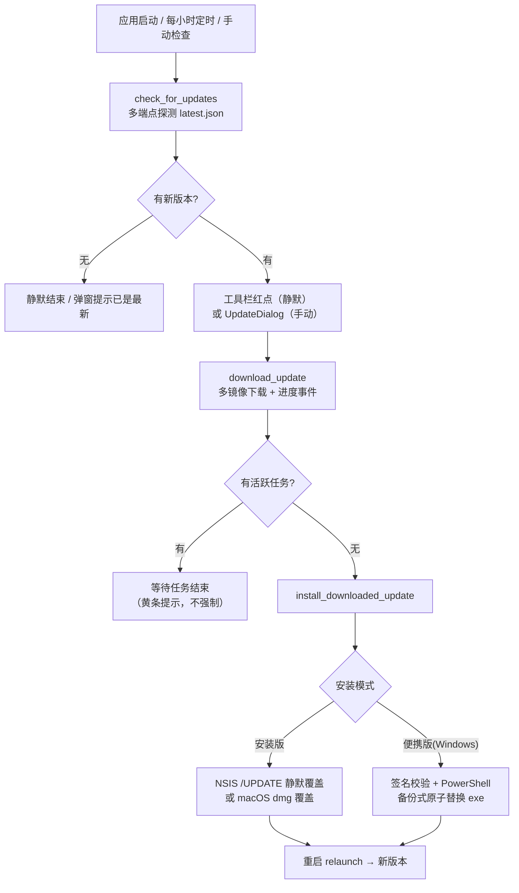

# 应用内更新机制（无感更新）设计与实现报告

本文是 DBX 桌面端"应用内更新 / 无感更新"机制的完整梳理报告，覆盖前端触发、Rust 后端下载与安装、Windows/macOS 平台差异以及发布侧（CI/CD）的配合方式。内容基于当前代码实现，不包含对未落地能力的推测。

## 1. 概述

DBX 的更新系统由三层协作完成：

1. **发布侧（CI/CD）**：打 tag 触发多平台构建，产出签名过的安装器 / 便携包 / dmg，生成 `latest.json` 版本清单，并同步到 GitHub、R2 CDN、CNB 三个镜像。
2. **Rust 后端（Tauri commands）**：承担版本探测、多镜像下载（带进度、取消、防卡死）、签名校验、安装执行。
3. **Vue 前端（状态机）**：承担触发时机（定时/手动）、UI 展示、空闲门控（有任务时不打断用户）、下载/安装/重启的状态流转。

核心理念可以概括为：**检查在后台静默、下载可中断可续、安装等空闲、替换有备份回滚、全程不碰用户数据**。

## 2. 总体流程



## 3. 更新检查（Check）

### 3.1 触发时机

- 桌面端启动后延迟 10 秒执行首次静默检查，之后每 60 分钟一次（`App.vue`）：

```ts
const UPDATE_CHECK_INTERVAL_MS = 60 * 60 * 1000;
setTimeout(() => {
  runUpdateNotificationChecks();
  if (updateNotificationsEnabled.value && !updateCheckTimer) {
    updateCheckTimer = setInterval(runUpdateNotificationChecks, UPDATE_CHECK_INTERVAL_MS);
  }
}, 10_000);
```

- 自动检查全部走 `checkUpdates({ silent: true })`：**有更新只点亮工具栏红点，不弹窗**；只有用户手动点击"检查更新"才打开 `UpdateDialog`。
- 用户可在设置中关闭"启用更新提醒"，关闭后停止自动检查与红点，手动检查仍可用。

### 3.2 多端点探测

`dbx_core` 的 `fetch_latest_release` 按用户选择的下载源（官方 / CNB）生成候选清单，**逐个请求，谁先成功用谁**，全部失败才报错：

```rust
fn update_check_candidates(source: crate::DownloadSource) -> Vec<String> {
    match source {
        crate::DownloadSource::Official => {
            vec![format!("{}{LATEST_JSON_R2_PATH}", crate::R2_CDN_BASE), LATEST_JSON_GITHUB_PATH.to_string()]
        }
        // CNB 暴露移动的最新 release，无需先问官方源拿版本号。
        crate::DownloadSource::Cnb => vec![
            LATEST_JSON_CNB_PATH.to_string(),
            format!("{}{LATEST_JSON_R2_PATH}", crate::R2_CDN_BASE),
            LATEST_JSON_GITHUB_PATH.to_string(),
        ],
    }
}
```

拿到 `latest.json` 后还会做两件补充：

- 调用 GitHub Release API 拉取发布标题与正文（`fetch_github_release_metadata`），用于弹窗展示；
- 非中文界面额外拉取 R2 上的英文 release notes（`changelog/latest-en.json`），并**校验其版本号与 latest.json 一致才采用**，防止 changelog 尚未同步时展示旧版本内容。

### 3.3 版本比较

不直接依赖 `semver` crate，而是用自定义的逐段数字比较（兼容 `v` 前缀、`-rc` 后缀等标签）：

```rust
pub fn is_newer_version(latest: &str, current: &str) -> bool {
    let latest_parts = parse_version(latest);
    let current_parts = parse_version(current);
    let max_len = latest_parts.len().max(current_parts.len());
    for i in 0..max_len {
        let latest_part = *latest_parts.get(i).unwrap_or(&0);
        let current_part = *current_parts.get(i).unwrap_or(&0);
        if latest_part > current_part { return true; }
        if latest_part < current_part { return false; }
    }
    false
}
```

### 3.4 返回给前端的 UpdateInfo

```rust
pub struct UpdateInfo {
    pub current_version: String,
    pub latest_version: String,
    pub update_available: bool,
    pub portable_mode: bool,       // 是否运行在便携模式（影响安装路径选择）
    pub manual_update_only: bool,  // 是否为 Win7 构建（必须手动装离线包）
    pub release_name: String,
    pub release_url: String,
    pub release_notes: String,
}
```

`portable_mode` 由数据目录解析逻辑注入：exe 旁存在 `portable.dbx` 标记文件即视为便携模式；`manual_update_only` 仅 Win7 特殊构建为 true。

## 4. 下载（Download）

下载命令 `download_update` 会根据是否便携模式分派到两条路径，两者共享同一套防卡死、可取消的基础设施。

### 4.1 安装版下载

核心流程（`update.rs::download_update_inner`）：

1. **复用 Tauri updater 引擎做版本探测**：`app.updater_builder().endpoints(...).build().check()`；
2. 拿到官方 `download_url` 后**不直接用**，而是生成多镜像候选列表（`installer_asset_candidates`）：
   - 官方源：R2 最新地址 → 原始 GitHub 地址 → 带 tag 的 GitHub 地址；
   - CNB 源：把 GitHub 资产 URL 重写为 CNB 镜像 → R2 → 原始地址；
3. **逐个尝试，失败自动切下一个镜像**，全部失败才报"所有镜像都不可用"；
4. 下载过程使用自定义实现而非插件默认，原因是要支持：
   - **实时进度事件**：每个网络块都向前端 `emit("update-download-progress", { downloaded, total })`；
   - **15 秒无数据判死**（stall 检测）：每次收到数据都会重置计时器，长时间无进展直接失败换镜像；
   - **取消**：`DownloadCancellation` 基于 tokio watch channel，前端点取消立即生效，正在进行的请求通过 `tokio::select!` 优先响应取消；
   - **系统代理自动透传**：macOS 用 `scutil --proxy` 解析，Windows 读注册表 `ProxyEnable/ProxyServer`，解析出的代理同时注入 updater builder 与下载客户端——国内网络能正常更新依赖这一点。

### 4.2 便携版下载（Windows 专用）

便携模式不走安装器，而是下载 `DBX_<版本>_<架构>-portable.zip` 与同名 `.sig` 签名文件，候选同样多镜像（CNB → R2 或 R2 → GitHub）。

下载完成后立即做**完整签名校验链**（`update_portable.rs`）：

1. 用内嵌于 `tauri.conf.json` 的 minisign 公钥验证 `.sig` 对 zip 的签名；
2. 解出 zip 内的 `portable-update.json` 清单，校验：schema 版本、目标版本必须严格新于当前版本、架构匹配；
3. 从 zip 提取 `DBX.exe`，校验 PE 头（MZ 魔数）与**清单中声明的 sha256 完全一致**——即"签名过的清单绑定具体的可执行文件"，防止任何中间人替换。

### 4.3 状态管理

下载/安装过程用一个内存状态机约束，保证任意时刻只有一个更新任务在途：

```rust
enum PendingUpdate {
    Downloading(Arc<DownloadCancellation>),
    Installing,
    Ready(ReadyUpdate),
}
```

- `begin_download`：已有下载或就绪任务时拒绝新请求；
- `finish_download`：通过 `Arc::ptr_eq` 比对取消令牌，**防止旧任务/过期请求误写状态**（配合前端 `activeDownloadAttempt` 计数双重防护）；
- 安装失败 `restore_ready` 回滚到"已就绪"，用户可以重试而不必重新下载。

## 5. 安装（Install）

### 5.1 安装版：交给 Tauri updater 引擎

```rust
ReadyUpdate::Installer { update, bytes } => {
    update.install(bytes).map_err(|error| format!("Failed to install update: {error}"))
}
```

`Update::install` 由 `tauri-plugin-updater` 按平台执行：

- **Windows**：安装器以静默/更新模式拉起。NSIS 模板显式处理 `/UPDATE` 命令行参数（`${GetOptions} $CMDLINE "/UPDATE"` → `UpdateMode=1`），更新模式**跳过卸载流程、不重建快捷方式、不清除用户数据**，原地覆盖安装；且 `tauri.conf.json` 中 `nsis.installMode: "currentUser"` 让安装器以当前用户权限运行，**不触发 UAC 管理员提权**——这是 Windows 无感更新的地基；
- **macOS**：插件挂载 dmg 并把新 .app 覆盖到现有位置，然后依赖签名/公证保证系统放行。

### 5.2 便携版：PowerShell 备份式原子替换

这是整套系统最"工程化"的部分（`update_portable.rs::launch_portable_update_helper`）：

1. 校验便携目录可写（写探针文件再删除）；
2. 把已校验的 exe 写入临时目录 `DBX.exe.new`，生成 `apply-update.ps1`；
3. 以 `CREATE_NO_WINDOW | CREATE_NEW_PROCESS_GROUP` 拉起 PowerShell——**无窗口、脱离父进程**，主进程随即正常退出；
4. 脚本等待父进程退出（最长 120 秒），然后执行替换：

```powershell
$installed = $false
for ($attempt = 0; $attempt -lt 120; $attempt++) {
    try {
        if (Test-Path -LiteralPath $TargetExe) {
            if (Test-Path -LiteralPath $BackupExe) { Remove-Item -LiteralPath $BackupExe -Force }
            Move-Item -LiteralPath $TargetExe -Destination $BackupExe -Force   # 旧 exe 先改名备份
        }
        if (-not (Test-Path -LiteralPath $BackupExe)) { throw 'The existing DBX executable could not be backed up.' }
        Move-Item -LiteralPath $SourceExe -Destination $TargetExe -Force       # 新 exe 移入原位
        $installed = $true
        break
    } catch {
        if (-not (Test-Path -LiteralPath $TargetExe) -and (Test-Path -LiteralPath $BackupExe)) {
            try { Copy-Item -LiteralPath $BackupExe -Destination $TargetExe -Force } catch {}  # 失败即还原
        }
        Start-Sleep -Seconds 1
    }
}
# 成功则重新拉起新版本，失败则还原旧 exe 后退出
```

- **最多重试 120 次**（约 2 分钟），任何时刻要么"旧 exe 在位"要么"新 exe 在位"，不存在空窗；
- 新版本拉起失败时自动还原备份并再次启动；
- 整个替换不动 `portable.dbx` 旁的 `data/` 目录，用户数据零丢失；
- 替换成功后清理备份与临时目录。

### 5.3 空闲门控：不打断用户干活

安装不会强插用户正在进行的操作。前端通过 `shouldBlockAppUpdate` 统计"执行中的 SQL / AI 分析 / 导出任务"数量，并在**下载前、下载后、安装前**三个节点检查：

```ts
export async function downloadAndInstallUpdateWhenIdle(options) {
  if (shouldBlockAppUpdate(options.getActiveTaskCount())) return "blocked";
  await options.download();
  if (shouldBlockAppUpdate(options.getActiveTaskCount())) return "downloaded"; // 下载完先停住
  await options.install();
  return "installed";
}
```

有任务在跑时下载完成后会停留，弹黄条提示"有 N 个任务正在执行，暂缓更新"，任务结束后用户点按钮再安装，**绝不强制重启丢掉正在跑的查询**。

## 6. 重启与退出协调

- **安装版**：安装成功后前端置 `updateReady`，用户点"重启"→ `tauri-plugin-process` 的 `relaunch()` 原地拉起新版本；
- **便携版**：不弹重启按钮，替换脚本拉起新版本后自动进入；
- 退出协调依赖 `CloseBehaviorState`：正常关闭窗口走"确认后退出"流程（防止误关），而更新路径先调用 `allow_next_exit()` 放行再 `app.exit(0)`，绕过确认弹窗，保证替换脚本能等到进程退出。

## 7. 平台差异（重点）

| 维度 | Windows（安装版） | Windows（便携版） | macOS | Linux |
|---|---|---|---|---|
| 更新产物 | NSIS 安装器 exe | `DBX_<ver>_<arch>-portable.zip` + `.sig` | dmg（签名 + 公证） | AppImage（插件默认流程） |
| 安装方式 | 静默 `/UPDATE` 覆盖安装 | PowerShell 备份式原子替换 exe | 挂载 dmg 覆盖 .app | 插件内建替换 |
| 权限要求 | 无（`installMode: currentUser`，不弹 UAC） | 无（仅要求目录可写） | 取决于安装位置 | 无 |
| 数据目录 | `%APPDATA%`，更新不触碰 | `portable.dbx` 旁 `data/`，零丢失 | 用户目录，更新不触碰 | 用户目录 |
| 签名校验 | 安装器数字签名（代码签名） | minisign 签名 + 清单 sha256 双校验 | Apple 签名 + 公证 | 无强制 |
| 是否支持便携版 | 支持（x64/arm64） | — | 不支持 | 不支持 |
| 特殊分支 | Win7 构建强制 `manual_update_only`，只能手动装专用离线安装包（捆绑 WebView2 109 运行时） | — | 无 | 桌面版之外还有 Docker / 静态浏览器版，走 `docker compose pull` 手动更新 |

需要特别说明的差异点：

1. **Windows 是唯一同时存在"安装版"与"便携版"两套更新通道的平台**。便携模式的判定依据是 exe 旁是否存在 `portable.dbx` 标记；若同时检测到安装器标记，则优先按安装版处理。
2. **macOS 没有便携版概念**，更新统一走 dmg 覆盖；由于 macOS 强制签名与公证，发布侧必须配置 Apple 证书与 notarization 凭据（`APPLE_SIGNING_IDENTITY` / `APPLE_ID` / `APPLE_PASSWORD` / `APPLE_TEAM_ID`），否则系统会阻止安装新版本。
3. **Windows 7 是刻意被排除在无感更新之外的**：`requires_manual_update(IS_WINDOWS_7_TARGET)` 直接返回 true，前端据此显示"必须使用 Windows 7 专用离线安装器"，因为老系统缺失现代 WebView2 且系统 API 受限，静默更新不可靠。
4. **前端行为在两平台一致**，差异全部收敛在 Rust 侧的分派（`portable_mode` → 便携安装路径，否则走插件安装路径）。

## 8. 发布侧（CI/CD）配合

无感更新闭环依赖发布流水线（`release.yml`）：

1. 打 `vX.Y.Z` tag 触发多平台矩阵构建（macOS aarch64/x64、Windows x64/arm64、Linux x64/arm64）；
2. Tauri 打包自动生成 `latest.json` 更新清单并上传 GitHub Release；
3. **Windows 便携版单独构建**：打包 `DBX.exe + portable.dbx 标记 + portable-update.json 清单` 成 zip，用 `tauri signer sign` 签名后连同 `.sig` 上传；
4. 后续任务将资产同步到 CNB 镜像（保留最近 5 个版本）、把 JDBC 插件版本元数据注入 `latest.json`；
5. 应用内两个官方端点（R2 CDN 的 `latest.json`、GitHub 的 `latest.json`）始终指向最新 release。

## 9. 健壮性设计总结

| 故障场景 | 应对机制 |
|---|---|
| 官方 CDN 挂了 | 多镜像候选（R2 → GitHub → CNB），逐个切换 |
| 国内网络不通 | CNB 镜像 + 系统代理自动透传 |
| 下载中途无数据 | 15 秒 stall 检测，判死后自动换镜像 |
| 用户点取消 | tokio watch 取消令牌，`select!` 优先响应 |
| 安装中任务正在跑 | 空闲门控，下载完先停住，绝不强杀 |
| 安装失败 | `restore_ready` 回滚到"已就绪"，可重试不重下 |
| 便携替换中断 | PowerShell 备份 + 120 次重试 + 失败自动还原 |
| 下载源偏好 | 设置项持久化（official / cnb），旧 AtomGit 值自动迁移为 CNB |
| 旧进程干扰新任务 | `Arc::ptr_eq` 令牌比对 + 前端 attempt 计数双保险 |

## 10. 结论

DBX 的无感更新不是某个单点技巧，而是一套"平台差异收敛 + 全链路容错"的系统：

- 前端把**打扰降到最低**（静默检查、红点提醒、空闲门控、可关闭）；
- Rust 后端把**下载做强**（多镜像、代理、进度、取消、防卡死）；
- 安装层把**替换做稳**（Windows 免 UAC 的 `/UPDATE` 静默安装；便携版签名校验 + 备份回滚式原子替换）；
- 发布侧把**链路做全**（签名产物、latest.json、三镜像同步）。

其中 Windows 平台同时支撑"免提权的静默安装器"与"便携版原子替换"两套方案，是理解整套设计的关键；macOS 则依赖签名/公证体系走 dmg 覆盖。两条路径共享同一套下载与状态管理设施，前端无需感知平台差异。
